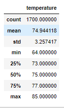
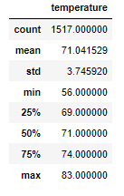

# Surf's Up

## Overview of The Analysis

W. Avy, an investor in a potential Surf and Ice Cream shop, wants to better understand the weather patterns in Oahu. This analysis focuses primarily on the months of June and December. The purpose of this analysis is to give a summary of statistical data for these months to help the investor make an informed decision. 

## Results

### Statistical Summary (June)

The first analysis provides the temperature statistics for the month of June. It reveals that the average temperatures in the month of June, in Oahu, are around 75F, with a standard deviation of 3.

### Statistical Summary (December)

The second analysis provides the temperature statistics for the month of December. It reveals that the average temperatures in the month of December, in Oahu, are around 71F, with a standard deviation of 4.

## Summary

Based on the results there are a few things we can conclude as well as some suggestions for moving forward.

1. Based on the stats, we see that the average temperature for these two months differ by around 4 degrees. The standard deviation is slightly higher for the month of December, meaning that there are a wider variety of temperatures from the average. However, given the small variance in the mean, I would suggest that, based on temperature alone, Oahu seems to have optimal weather patterns for a surf and ice cream shop.

2. An additional query I would run, in order to better understand the conditions of Oahu, would be a query on the statistics for rainfall in these two months. Getting the average and standard deviations for rainfall could have a big impact on the success of a shop like this.